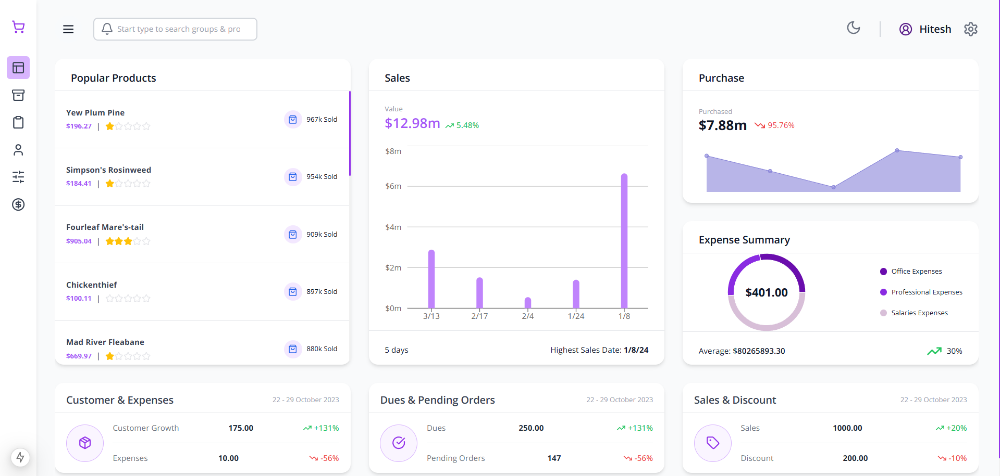
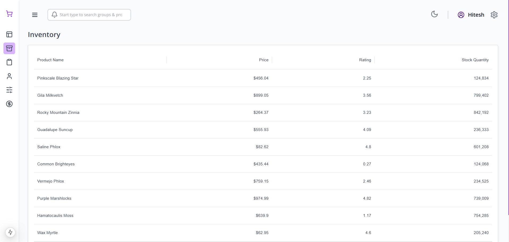
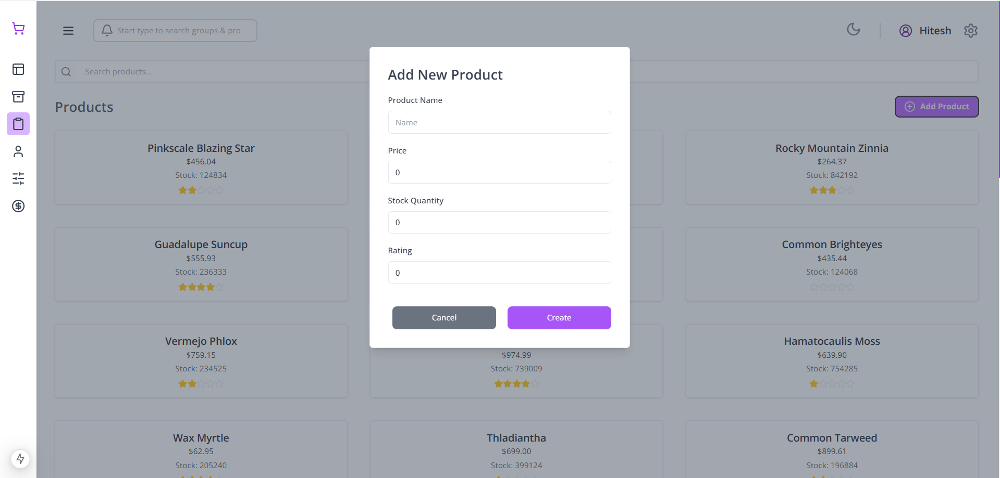
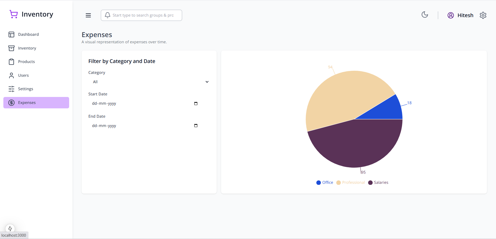

# Inventory Management System

## Overview

The **Inventory Management System** is a web application built with **Next.js** for the frontend and **Node.js (Express)** for the backend. It allows businesses to manage their inventory efficiently by tracking products, sales, purchases, and expenses. The application is deployed on **AWS** using a secure and scalable architecture.

## Features

- **Product Management:** Add, update, delete, and view products with stock details.
- **Sales & Purchase Tracking:** Monitor sales and purchases with graphical reports.
- **Expense Management:** Categorized tracking of expenses with filtering options.
- **User Authentication:** Secure login and role-based access control.
- **Dashboard:** Real-time analytics and insights on sales, expenses, and inventory.

## Tech Stack

### Frontend

- **Framework:** [Next.js](https://nextjs.org/)
- **UI Library:** Tailwind CSS
- **State Management:** React Context API / Redux (if applicable)

### Backend

- **Framework:** [Node.js](https://nodejs.org/) with [Express.js](https://expressjs.com/)
- **Database:** PostgreSQL / MySQL (Specify which one is used)
- **Authentication:** JWT (JSON Web Tokens)

### Deployment & Infrastructure

The application is hosted on **AWS** using the following architecture:

- **AWS VPC:** A Virtual Private Cloud with public and private subnets.
- **Amazon EC2:** Backend service running inside a public subnet.
- **Amazon RDS:** Database running inside a private subnet.
- **AWS Amplify:** Hosting the Next.js frontend.
- **AWS S3:** Storing static assets like images and documents.
- **Security:** Firewalls for network security and VPC Internet Gateway for external access.

## Installation & Setup

### Prerequisites

Ensure you have the following installed:

- Node.js (>= 14.x)
- PostgreSQL / MySQL
- AWS CLI (for deployment)

### Backend Setup

1. Clone the repository:
   ```bash
   git clone https://github.com/your-repo/inventory-management.git
   cd inventory-management/backend
   ```
2. Install dependencies:
   ```bash
   npm install
   ```
3. Create a `.env` file and configure your database and JWT secret:
   ```env
    PORT=5000
    DATABASE_URL=your-db-url
   ```
4. Start the backend server:
   ```bash
   npm run dev
   ```

### Frontend Setup

1. Navigate to the frontend directory:
   ```bash
   cd ../frontend
   ```
2. Install dependencies:
   ```bash
   npm install
   ```
3. Create a `.env.local` file for frontend environment variables:
   ```env
   NEXT_PUBLIC_API_BASE_URL=http://localhost:5000
   ```
4. Start the development server:
   ```bash
   npm run dev
   ```

## Deployment

### AWS Deployment

#### Backend (Node.js Express on EC2)

1. Package the backend application and upload it to the EC2 instance.
2. Use **PM2** to run the server in production mode:
   ```bash
   pm2 start server.js
   ```
3. Set up **Nginx** as a reverse proxy (if applicable).

#### Frontend (Next.js on AWS Amplify)

1. Connect the GitHub repository to AWS Amplify.
2. Configure the build settings in Amplify.
3. Deploy the application with automatic CI/CD.

## Usage

- Visit the hosted frontend URL and log in.
- Manage products, sales, and expenses from the dashboard.
- View graphical reports and analytics.

## Screenshots

Screenshots of the application can be found in the `screenshots` directory. To display them in this README, use the following format:

```markdown






```

## Contributing

Contributions are welcome! Please follow these steps:

1. Fork the repository.
2. Create a feature branch (`git checkout -b feature-branch`).
3. Commit your changes (`git commit -m 'Add new feature'`).
4. Push to the branch (`git push origin feature-branch`).
5. Create a pull request.

## License

This project is licensed under the MIT License.
